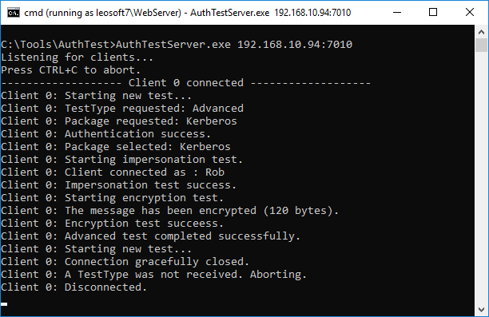

# AuthTest

AuthTest is a tool for testing the various authentication methods & protocols available in the Windows Operating System.

AuthTest is a two-part tool consisting of a server and a client. The server runs on the destination computer and receives client connections. The client runs on the source computer and connects to the server to run the desired test.

## Client

Launch the client and specify the test parameters:

- **Server name or IP:** The destination computer running AuthTestServer.exe. 
- **TCP Port:** The TCP port in which the server is listening to.
- **Target or SPN:** SPN, UPN, or SamAccountName used to run AuthTestServer.exe.
- **Package:** The authentication package to be used: Negotiate, Kerberos, NTLM, or CredSSP.

Credentials:

- **Implicit:** Use the credentials of the current user (account used to launch AuthTestClient.exe)
- **Explicit:** Specify different credentials

Test Type:

- **Basic:** Tests authentication only.
- **Advanced:** Tests authentication, impersonation, and encryption.

## Server

Launch the sever on the destination computer to start listening for client connections:

AuthTestServer.exe <address>:<port>

## Authentication overview

Authentication is the process of confirming the identity of a client to a server, and optionally, a server to a client (mutual authentication).

Authentication on Windows is performed through SSPI (Security Support Provider Interface), a set of APIs that conveniently abstracts all the complexities of security-related operations and exposes a standard interface for user-mode and kernel-mode applications.

SSPI offers a variety of authentication packages:

### Negotiate

Negotiate is the most widely used authentication package in the Windows Patform. Negotiate is not an authentication protocol in itself, it simply analyzes the parameters and selects the most secure protocol available to perform the authentication.

It first checks if Kerberos can be used by analyzing the Target name provided. If a Target is not specified, or contains a target that cannot be uniquely found in Active Directory, NTLM is used.

### Kerberos

Kerberos relies on a trusted third-party (domain controller) to verify the identity of both the client and the server. For this reason, all nodes must be domain joined. From a very high level, the sequence of steps are:

1. Kerberos starts with the client verifying it's own identity with a domain controller by obtaining a TGT (Ticket Granting Ticket). This typically happens at logon and is valid for 10 hours.
2. When the client is ready to perform the authentication, it requests a TGS (Ticket Granting Service) to the domain controller for the specified Target. The Domain controller searches the forest for a user or computer account that matches the Target. If more than one or no account is found, kerberos fails. A failure at this early stage allows the client to attempt NTLM if the Negotiate package is being used. 
3. If the domain controller finds an account matching the Target, it issues a TGS typically valid for 10 hours.
4. The client sends the TGS to the server, which is able to validade it without needing to contact a domain controller. If validation succeeds, both sides have a session key (CtxtHandle) that can be used for establishing a secure channel. Kerberos authentication is then complete.

### NTLM

NTLM is most commonly used between computers not joined to a domain, or as a fallback protocol when Kerberos cannot be used. NTLM relies on a challenge/response mechanism to verify the client's identity. This is the protocol sequence for NTLMv2:

1. The client sends the Username in plaintext to the server.
2. The server generates a 16-byte random number called challenge or NONCE, and sends it to the client.
3. The client generates a unicode uppercase version of the username, and concatenates it to the unicode domain name (if the machine is domain-joined) or server name (if not domain-joined).
4. HMAC-MD5 is applied to this value using the NT hash of user's password as a key. This results in 128 bit output known as the NTLMv2 hash.
5. The client then generates its own 16-byte challenge by concatenating a timestamp, some target information, and the server challenge.
6. HMAC-MD5 is applied to this value using the NTLMv2 hash as a key (obtained in step 4). This results in 128 bit output, called NTLMv2 Response, which is sent to the server.
9. The Server sends the username, the original challenge, and the NTLMv2 response to the domain controller.
10. The domain controller repeats the same steps the client did and compare the results. If they match, the DC confirms the authentication to the server.
11. The server informs the client whether the authentication succeeded or failed. This occurs outside SSPI.

### CredSSP

CredSSP (Credential Security Support Provider) is mostly used in unconstrained delegation scenarios, providing a secure way to pass the user credentials to the server. CredSSP establishes a TLS (Transport Layer Security) tunnel between the client and the server, then uses the Negotiate package for authentication (which selects either Kerberos or NTLM). 

The server can then use the client's credentials to initiate another round of authentication to a second destination, process known as Second-Hop authentication. CredSSP is used in RDS (Remote Desktop Services), WinRM (Windows Remote Management), Remote PowerShell, Hyper-V Live Migration, etc.

## Scenarios

AuthTest can test a variety of authentication scenarios, including domain-joined, non domain-joined/no trust, and special accounts. AuthTest can also perform stress test.

### Example 1: Negotiate to Kerberos

In this scenario, the client specifies target "Cindy", which uniquely maps to the user account running the server, so the Negotiate package selects Kerberos and the authentication completes successfully:

### Example 2: CredSSP over NTLM

In this scenario, a non domain-joined client attempts CredSSP against a domain-joined computer. In order to establish a TLS tunnel, the server creates a self-signed certificate in the computer store:

Because the client is non domain-joined, the Negotiate package selects NTLM and authentication completes successfully:

### Example 3: Special accounts

Authtest can test the authentication of services running under special accounts, such as "NT AUTHORITY\Network Service" or "LocalSystem". For this use PsExec (Sysinternals) and the command-line version of the client **AuthTestClientCmd.exe** :

### Example 4: Stress test

AuthTest can test the performance of backend services by producing repeated authentication requests in a loop. 

**WARNING:** Stress test can impose severe stress on domain controllers. Use with caution.

